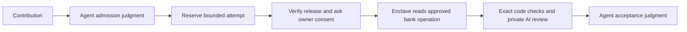
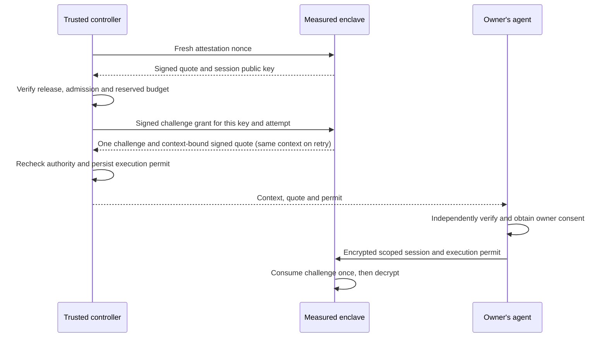

# Verification and agent maintenance

OpenPlaid is building a verifier that checks real bank evidence while keeping session
secrets inside an independently verifiable enclave. Agents can inspect the code,
public prompts, policies and release measurements before asking an account owner
to consent. AI advice does not independently authorize acceptance or payment.

## Current status

The repository includes a development implementation of transactional admission,
bounded budgets, agent judgments, AWS attestation verification, encrypted one-use
sessions, approved-operation acquisition, and a closed AI evaluation protocol.
The release manifest is deliberately **unreleased**, the Mercury acquisition policy
is **disabled**, and there is **no public live verification endpoint yet**. No bank
secrets should be sent until the release and end-to-end checks are complete.

No scheduled agent task or automatic payout is enabled. Existing Round 1 terms remain
unchanged. A contribution can still earn its advertised parser award without meeting
new, unpublished cryptographic-verification requirements.

A [synthetic Venice protocol probe](../verification/infra/evidence/2026-09-23-venice-synthetic-protocol.json)
reached encrypted inference and obtained a valid legacy signature, but the signed
hashes did not match the client-visible request/response bytes. The model also
returned reasoning chunks rejected by the closed decoder. This is a failed protocol
acceptance check, not approval to transmit bank evidence. One request reserved $0.05;
actual billing is not yet reconciled. No private bank data was sent.

## Readable by people and agents

- [Agent contract](../verification/agent-contract.json): capabilities, states, decisions and reason codes.
- [Operator skill](../skills/operate-verifier/SKILL.md): how an agent reviews and records progression.
- [Release manifest](../verification/release.json): independent release pinning and readiness.
- [Public model prompt](../verification/prompts/payment-review-v1.txt): the exact review task.
- [Service policy](../verification/policies/service.json): spending, attempts, sizes and authority limits.
- [Mercury source policy](../verification/policies/mercury.json): exact approved surface; currently pending review.
- [Deployment runbook](../verification/infra/README.md): pilot target, validation and cleanup.



## Run locally

Python 3.11+ and OpenSSL are required for verifier development. No live credentials
are needed for the security tests.

```sh
python3 -m venv .local/verifier-venv
.local/verifier-venv/bin/pip install -r verification/requirements.lock
.local/verifier-venv/bin/python -m unittest discover -s verification/tests -v
.local/verifier-venv/bin/python -m verification.cli status
.local/verifier-venv/bin/python -m verification.cli --help
```

The local CLI is an authenticated-operator boundary by deployment, not a public HTTP
API. Do not expose it to PR code, contributors, or an agent interpreting bank content.
SQLite must live on one durable controller; do not run independent database replicas
and assume quotas are global. Judgments bind the current state version and an evidence
digest. A future scheduler can call the same interface; none is configured now.

## Protecting secrets

PCR8 identifies the release signing certificate, not the exact image. Clients require
PCR0/1/2 as well, a fresh nonce, a public key inside the signed attestation, and a policy
digest. The AWS root certificate is pinned by its published SHA-256 fingerprint.
Certificate-chain checks use OpenSSL; COSE signatures are verified locally. A boolean
from the server is never accepted as attestation.

After verification and explicit owner consent, the client encrypts the scoped session
to the attested key. Each challenge expires after two minutes and can be consumed once.
Credentials and original records are not written to the ledger, public logs, CI or Git.
Approved source policy constructs the entire bank request. Contributors cannot supply
arbitrary URLs, redirect targets, HTTP methods, or credential destinations.

Private AI processing must use a separately verified Venice E2EE connection from the
enclave. No plaintext or non-TEE fallback is permitted. Before this is fully integrated
and tested, live AI evaluation remains unavailable. Hosted Jev is not assumed to have
equivalent confidential processing.

## Abuse and griefing controls

An assigned contribution needs an operator judgment before consuming bank/model resources.
Attempts are tied to artifact, release, policy and prompt digests. Atomic reservations
prevent concurrent overspend; retries retain the original reservation. Failed/uncertain
attempts consume their upper-bound allowance. Five attempts and $0.25 per ticket are
development defaults. The task cap is $50, with a separate $5 inference reservation cap.
Infrastructure and purchases must be reserved before they are incurred. These controls
do not replace actual provider caps and finite resource lifetimes.

The AI receives a fixed task and bounded candidates, no tools or credentials. Output
accepts only enumerated decisions and known field references. No model explanations or
arbitrary completion text are returned to contributors. Exact fields and transaction
joins remain code checks. Unknown evidence and disagreement require review, not retries
until a model happens to agree. Public production prompts are versioned; private
adversarial holdouts must be stored separately and never run on untrusted PR hosts.

## Limits

Passing tests is not proof of no vulnerabilities. This development verifier has not
been independently audited. Mercury's current parser describes sender-bank-reported
sent domestic USD wires, not recipient credit or irreversible settlement. An OpenPlaid
verification result is not a Peer settlement signature. Signing, merging and payout
authority must remain separate from untrusted adapter code and model output.

## Machine-readable readiness

Run `npm run verify:readiness`. Exit code 2 means the release cannot accept secrets;
its JSON lists the specific blockers. Configuration alone cannot turn the pilot into
a live service. The current runtime only provides status and attestation operations.
The client secret-sharing helper additionally requires an explicitly live release,
fresh cryptographic verification, the caller's expected contribution binding, and consent.

The policy commitment covers service limits, source destinations, the public prompt,
model trust and controller key configuration. Changing any of these requires a new
reviewed commitment. Dependency installation uses pinned wheel hashes. An independently
reproduced enclave image and actual hardware evidence are still release requirements.

## Remaining release work

| Component | Current state | Required before live release |
| --- | --- | --- |
| Agent admission and spending | Local transactional CLI, tested | Trusted controller deployment and recovery procedure |
| Nitro identity and session channel | Real Nitro attestation and tampering smoke passed; channel crypto tested locally | Independent rebuild, published image/measurements, hardware secret-sharing flow |
| Bank acquisition | Bounded reader and killable process watchdog; source policy disabled | Review exact bank operation and scope; hardware-test the fixed-destination Nitro relay |
| Independent expected result | Separate Python Mercury reference interpreter and negative tests | Independent field-provenance review and integration with authenticated acquisition |
| Contributor execution | Wasm worker and real Mercury synthetic cases passed locally, in Linux CI and a disposable Nitro image | Live-pipeline hardware validation; integrate the signed-permit adapter/oracle stage with authenticated acquisition and one-use runtime sessions |
| Venice review | Encryption and output validation tested locally | CPU/GPU/application verification, key binding and real provider test |
| Verification receipt | Signing, attestation validation and transactional controller acceptance tested | Integrate issuance with the completed enclave evidence pipeline |
| Live consent flow | Client helper only | End-to-end owner consent, encrypted submission and receipt verification |
| Recurring agent judgment | Intentionally absent | Separate future authorization; existing CLI remains usable manually |
| Awards and payouts | Existing published terms | Separate bounded award authority; model output never releases funds |

A trusted maintainer must review changes to the verifier, source/model policies,
release measurements and CI separately from ordinary adapter contributions. PR code
runs only in credential-free CI. Private holdouts and live credentials must never be
made available through a PR workflow or `pull_request_target` checkout.

### Hardware pilot evidence

The [September 23 pilot report](../verification/infra/evidence/2026-09-23-nitro-smoke.json)
records a real non-debug Nitro enclave. Its signed attestation passed AWS certificate
chain and signature verification, fresh nonce, public-key, policy and PCR0/1/2/8
binding checks. Altered nonce, key, policy, measurement and document were rejected.
The runtime also rejected live verification requests. The pilot used no bank credentials
or model key. Its temporary host was deleted after testing.

This is an operator-reported smoke test, not a public approved release or independent
rebuild. The report identifies the base commit and startup patch used for the image;
its measurements must not be copied into a client trust manifest. The complete payment
verification pipeline remains disabled. Venice API authentication has been checked
with a restricted key; provider attestation and paid inference are not yet verified.

### Provider diagnostics

Developer setup installs the operator tooling outside the enclave runtime. To install it separately, use
`.local/verifier-venv/bin/pip install -r verification/requirements-attestation.lock`.
Then run `.local/verifier-venv/bin/python -m verification.provider_diagnostic
--report <local-report.json> --nonce <original-caller-nonce>` with a fresh provider
report and the nonce generated **before** requesting it. Never copy a nonce from
an untrusted report as the expected challenge. The command fetches public Intel
verification collateral from Phala PCCS; it needs no API key and sends no inference.
Its JSON separates CPU cryptography, strict CPU policy and protocol-specific binding.
`--binding-protocol aci-v1` is the default. Select `--binding-protocol legacy-v1`
explicitly for the documented compatibility endpoint; no failed ACI check triggers
a fallback. Legacy verification derives the Ethereum address from the curve-validated
encryption key and checks the signed address, zero padding and original nonce. It does
not authenticate the adjacent ACI keyset or approve receipt keys.
It always exits 2 and never returns an approved key or authorizes disclosure.

Add `--verify-gpu` to submit only the provider's public GPU attestation evidence to
[NVIDIA NRAS v3](https://docs.api.nvidia.com/attestation/reference/attestmultigpu_1).
The diagnostic obtains signing keys from NVIDIA's fixed HTTPS
[JWKS endpoint](https://docs.api.nvidia.com/attestation/reference/keys), verifies ES384
signatures and issuer/time/nonce claims, and checks every detached GPU token against
the platform token's signed digest. Device claims must show secure boot, disabled
debugging and successful measurements. Redirects and token-supplied key URLs are refused.
This operator CLI is not a public request handler or an enclave egress relay.

The pilot's signed GPU evidence passed. `gpuEvidenceVerified` means that evidence
verified; `cpuGpuLinkageVerified` and `gpuVerified` remain false because the serving
path is not verified. The gateway is CPU-only and forwards upstream GPU evidence;
the same nonce in two valid reports does not establish their workload connection.

The [September 23 diagnostic](../verification/infra/evidence/2026-09-23-venice-diagnostic.json)
checked one fresh `e2ee-qwen-2-5-7b-p` response. Intel quote cryptography passed,
but strict platform policy rejected it. Initial ACI binding checks failed because
the compatibility endpoint uses legacy address-plus-nonce report data despite its
adjacent ACI metadata. The provider's pinned implementation documents this behavior;
explicit legacy checking passed the encryption-key and original-nonce binding.
This is not a claim about all Venice models. Reviewing platform policy remains
necessary; CPU-to-GPU linkage, application identity, key custody and response authenticity
must also pass before private evidence can be sent. The server's `verified` field
does not override any of these checks.

Binding follows the provider's [pinned ACI specification](https://github.com/Dstack-TEE/private-ai-gateway/blob/8d0a666a2418898a8c823a9af49a634edd122a64/spec/aci.md#32-attestation-binding).
The separate compatibility layout is documented in its [legacy implementation](https://github.com/Dstack-TEE/private-ai-gateway/blob/8d0a666a2418898a8c823a9af49a634edd122a64/src/aggregator/service/e2ee.rs).
CPU diagnostics use the [DCAP verifier's strict policy](https://github.com/Phala-Network/dcap-qvl/blob/v0.6.3/docs/policy.md).

### Contributor sandbox

[Linux CI run 35835007397](https://github.com/0xSachinK/openplaid/actions/runs/35835007397)
passed all 124 tests and the five-case real Mercury Wasm smoke on commit `6563257`.
The worker retains its 1 GiB Linux address-space limit and disables extra Wasmtime
growth reservations. This is synthetic execution evidence, not authenticated bank
evidence or validation inside Nitro.

`verification.sandbox.run_adapter` executes a Wasm artifact in a fresh isolated Python
worker with a minimal WASI interface. The controller must supply its admitted artifact
digest; mismatched bytes are rejected before launch. Never take the expected digest
from the same untrusted submission. The guest sees only its JSON input and bounded
stdout, no host environment, file paths, sockets, credentials or signing functions.
Stderr and guest exception text are discarded. The result remains untrusted.

Limits are fixed in reviewed code: 2 MiB module, 1 MiB input, 8 KiB total guest output,
64 MiB linear memory, 50 million fuel units, 5 CPU seconds and a 10-second parent
deadline. Linux additionally limits the worker's address space to 1 GiB. The compiler
and Wasmtime native runtime are part of the trusted computing base; this is not a
claim that an interpreter or runtime can never have a vulnerability. No untrusted
serialized native-code cache is loaded. Each request starts with a fresh process.

Run `npm run verify:sandbox-smoke` to install the hash-pinned public Javy compiler,
build the actual Mercury JavaScript parser into Wasm, and test positive and negative
synthetic inputs. This runs in credential-free CI. Build metadata records source,
wrapper, compiler and artifact digests under ignored `.local/verification/`; building
does not grant admission. Static deterministic compilation is required, and two
consecutive builds must match. This is a repeat-build check, not independent Nitro
release reproduction. The guest has no cryptographic randomness requirement.
`JAVY_BIN` may select a local compiler, but its hash must
match the reviewed platform pin. Compilation belongs in a bounded build job, never
in the live evidence-processing request.

The Wasm worker passed the September 23 Nitro component test, but is not connected
to the complete bank/oracle/model/receipt pipeline. Runtime verification remains disabled. Private
holdouts must run on a trusted operator host, outside contributor PR CI, with only
minimal outcomes retained and no raw inputs or guest output in logs.

### Receipt acceptance boundary

The controller cannot mark an attempt verified from a plain result string. It checks
an RSA-PSS receipt against a fresh Nitro-attested key and an independently pinned live
release, then atomically matches its ticket, capability and full reserved binding.
Receipts use a contribution-verification audience, short expiry, fixed fields and no
bank account/payment details. The ledger retains minimal claims and cryptographic
provenance digests for operator auditing. Duplicate delivery is idempotent; conflicts,
pause and revocation fail closed. Ordinary operator reconciliation can record a failed
attempt, but cannot manufacture success. Runtime issuance is still disabled until the
bank/oracle/sandbox/model pipeline exists and passes end-to-end verification.

### Mercury reference interpretation

`verification/mercury_oracle.py` separately interprets the documented synthetic
Mercury surface without importing contributor code. It uses decimal arithmetic,
checks calendar dates, rejects duplicate selected transactions and ambiguous payer
joins, and requires full recipient identifiers. Its candidate projection excludes
memos and display names. This is a reference implementation for the narrow sent-wire
claim, not proof that uploaded JSON is authentic. It must consume authenticated bank
acquisition inside the verifier; the source policy is still disabled pending review.

### Admission-bound adapter comparison

`verification.adapter_check.check_adapter` verifies the controller-signed permit
against the actual Wasm digest, enclave key, policy and session challenge before
running the independent oracle or guest. The guest output must match the narrow
Mercury contract and every independently extracted payment field. Mismatches and
abstentions stop before model evaluation. Free-form adapter limitations and reasons
never enter the model evidence projection.

The sandbox smoke also runs the real compiled Mercury adapter through this stage
with a synthetic controller permit. Unit tests exercise forged payment fields,
false authenticity claims, invented provenance and invalid admission bindings.
This internal stage does not consume session challenges, authenticate bank input,
call Venice or issue receipts. The live runtime must supply its pinned operator
key and consume its one-use encrypted session before calling it. No new public
endpoint is enabled.

### Bank acquisition process boundary

`verification.acquisition_process.fetch_source_isolated` starts a credential-free
environment and passes the trusted source policy and session headers through stdin.
Its 20-second process deadline includes a blocked OS DNS lookup, connection attempts,
TLS and response parsing. The worker also disables core dumps and applies CPU and
Linux address-space limits. A timeout kills and reaps the worker; it does not retry
or release the attempt's spending reservation. Errors expose fixed codes only.

Tests exercise a genuinely stalled DNS call in a child process, private-address
rejection, worker protocol success and suppression of credential-bearing exceptions.
The success case substitutes a synthetic reader; it is not a live bank test. This
transport is for direct-network integration testing. The fixed-destination Nitro relay is implemented but still needs hardware validation;
TLS stays in the enclave-side acquisition worker.
The Mercury source policy remains disabled and no session endpoint is enabled.

### Mercury history operation review — 2026-09-23

Read-only inspection of an owner-authorized browser session showed that transaction
history uses **POST**, despite being a read operation. The observed destination is
`https://backend.mercury.com/organizations/{organizationId}/transactions-lite`.
The response includes the transaction and party collections and the narrow outgoing
wire fields expected by the parser. [Observation and limitations](../verification/infra/evidence/2026-09-23-mercury-source-review.json)
contain only schema metadata and boolean checks, not original banking values.

The reader now supports exactly this POST operation when an independently approved
policy selects `id: mercury-history-v1`, the exact origin, and the path template
above. `source_context` contains only `organizationId`, validated as a lowercase
UUID. The operation builds its own JSON body: limit 100, descending date order,
`startAfter`, UTC timezone. Callers cannot submit a body, URL, filter, page size or
alternate operation. Credentials cannot override HTTP framing or content headers.
Existing GET operations remain available only through trusted policy.

This is first-page acquisition, not complete-history discovery. The UTC variant,
minimum session-cookie/CSRF/device requirements, organization authorization and
actual enclave acquisition remain untested. The organization selector must come
from the owner's consented encrypted session, and Mercury must authenticate access;
a UUID itself confers no authority. Do not export the whole browser cookie jar.
The public source policy remains disabled pending those checks. No captured request
was replayed, no credentials were exported, and no bank evidence went to Venice.

### Fixed-destination Nitro relay

The parent starts `python -m verification.relay --enclave-cid <verified-cid>`. It
refuses startup while the installed Mercury source policy is disabled. It accepts
only that enclave CID on vsock port 5001 and connects only to the installed policy's
single public HTTPS origin on port 443. The connection contains no host/path command
or destination negotiation. DNS answers are checked before connecting.

`fetch_source_isolated(..., transport="nitro")` selects the fixed parent tunnel
from trusted runtime configuration. Certificate and hostname verification remain
in the enclave-side reader. The parent only forwards ciphertext. Each connection
has a 20-second killable worker, 2 MiB per-direction transfer cap and 64 KiB
per-direction buffer cap. Connections are serialized and limited to six per minute
per listener. These controls supplement controller admission; the relay has no
spending or payment authority.

Local tests cover two-way forwarding, half-close handling, transfer/deadline limits,
disabled-policy startup, fixed parent addressing and a real certificate-verified
TLS exchange through the byte pump using synthetic data. These socket-pair tests
do not establish AF_VSOCK behavior on Nitro. No relay is deployed or enabled.

### Protected synthetic holdouts

The trusted maintainer runs `python -m verification.holdouts --suite <private-file>
--artifact <admitted-wasm> --artifact-digest <admitted-sha256>`. Run from reviewed
controller code, never a contributor checkout or PR job. Private suites remain
outside Git (for example under owner-only `.local/verification/private-holdouts/`)
and must be regular files owned by the operator with no group/other permissions.
Use synthetic data only; the `syntheticOnly` field is an operator assertion, not a
classifier capable of proving that data is synthetic.

A suite has `schemaVersion: "1"`, an opaque `suiteId`, `syntheticOnly: true`, and
9–32 `cases`. Each case contains `category`, `input` (`evidence`, `transactionId`)
and `expected`: either `"abstain"` or the exact independent payment-facts object.
Required categories are positive, payer, payee, amount, currency, status, missing,
duplicate and injection. Positive and injection cases must expect supported facts.
Maintainers independently review the case content and expected-result rationale;
category labels alone do not establish coverage. Keep case details and randomized
values private, and refresh suites as the integration changes.

The runner pins the actual artifact digest and executes every case in a fresh
bounded Wasm worker. Crashes do not count as abstentions. It returns only an aggregate
pass/fail, count, opaque suite/run IDs, time, artifact digest and harness-source digest.
It does not return failed-case identities, inputs, facts, memos, reasons or guest output.
No AI call or payout occurs. Each case inherits the 10-second worker deadline; at
most 32 cases run. Retain the report in the operator's judgment evidence bundle.
A local report is not signed remote proof; protected controller deployment and
independent review remain necessary. CI tests only the public runner protocol using
public synthetic fixtures; it never loads the operator's private suite.

### Durable execution authorization

Before allocating a session, `Ledger.authorize_challenge` verifies a fresh quote
against the controller's independently pinned live release and random nonce. It
checks the reserved attempt, admission, binding, expiry and pause state inside a
transaction, then durably signs one short-lived challenge grant for that enclave
key. Retries return the stored grant without renewing it; an enclave restart cannot
redirect the same reservation to another key. This step needs no bank credentials.

`SessionChannel.challenge_authorized` checks that signature against the measured
operator key and policy before allocating state. Concurrent retries return the same
context. Spent-attempt records remain until expiry, preventing a replay from creating
another challenge even after malformed ciphertext consumes the first one. Both
pending challenges and retained admission records have a 100-entry cap. A challenge
grant has a distinct audience and cannot serve as an execution permit.



The trusted controller calls `Ledger.authorize_execution` only for a reserved
attempt. It verifies a fresh Nitro document whose nonce is the SHA-256 digest of
the exact session context, then checks the approved live release, pinned key, policy,
artifact, reservation, ticket state, expiry and pause state. Initial issuance also
requires the prior challenge grant for the same enclave and binding, and cannot
outlive that grant. It signs the permit
inside the database transaction and persists it before returning. Concurrent callers
receive the same stored permit. A different enclave key or challenge cannot replace
it, and retries never extend its lifetime or increase its budget. Failed/uncertain
attempts retain their spending reservation.

This internal controller API has no contributor route or CLI key argument. The
signing key must come from trusted controller provisioning, with its public key
pinned in the measured policy. Tests cover concurrent issuance, revoked/paused/
finished attempts, binding failures and a complete synthetic certificate/COSE/signature
path. The production runtime must still consume the one-use encrypted session
challenge before executing; durable issuance alone does not prevent replay of a
permit against a runtime that omits that check. Controller deployment, key provisioning
and the live handshake remain unfinished.

Revocation or pausing prevents further controller authorization. An already signed
offline permit can remain usable until its at-most-two-minute expiry; immediate
revocation would require an additional live check or stopping the enclave. Grant
expiry, failed decryption and enclave restarts do not refund reservations. Reconcile
the attempt through the operator workflow instead of reminting authority.

### Authorized one-use session decryption

`SessionChannel.decrypt_authorized` connects the signed execution permit to the
ephemeral enclave key and existing session challenge. The operator public key,
policy digest and admitted artifact digest come from trusted runtime state, never
submission-selected trust values. Signature, key, policy, artifact, attempt and
challenge checks precede challenge consumption. Invalid authority leaves the
legitimate challenge intact. A valid authorized request consumes it atomically before
decryption, including if ciphertext authentication fails. Concurrent retries decrypt
at most once; restart generates a new RSA key and rejects old permits.

The runtime now accepts `{"operation":"challenge","grant":<signed admission>}`
only when its measured operator policy enables a pinned public key. It verifies the
grant before allocating state or requesting an NSM quote, and returns `{context, quote}`.
The quote's nonce is SHA-256 of the canonical context. The client independently
requires that exact binding before encryption; a valid freshness-only quote or
modified context cannot authorize secret sharing. Challenge and ordinary attestation
requests share the ten-quotes-per-minute limit. Retries retain the original context.

The integration test covers this runtime route, a signed synthetic Nitro chain,
durable permit issuance, client consent-gated encryption, authorized decryption and
replay rejection. It is not a hardware end-to-end test. The checked-in operator policy
is disabled, so deployed pilots still reject challenge setup. Operator provisioning,
the evidence pipeline and an execution endpoint remain unfinished; no endpoint
accepts or decrypts a submitted session.

### Nitro component hardware run — 2026-09-23

A separate non-debug test image ran 16 sandbox/session/relay byte-pump unit tests
and four real Mercury Wasm cases inside Nitro. Fresh AWS-chain attestation verified
PCR0/1/2/8, nonce, key and policy binding; altered evidence was rejected. The test
image exposes cached synthetic results only and is not a live verifier release.
[Operator-reported build evidence](../verification/infra/evidence/2026-09-23-nitro-components.json)
records the source, base image, EIF and adapter digests and exact limitations.

The Linux adapter build on AWS matched the independently executed Linux CI build.
The macOS build has a different digest despite the same compiled JavaScript;
reproducibility claims must name the platform/compiler pin. No independent rebuild
of the complete enclave image is established. Real vsock egress, live bank/model
data, private holdouts in Nitro and the complete verification flow remain untested.

### Enclave build repeatability — 2026-09-23

The [build experiment](../verification/infra/evidence/2026-09-23-nitro-reproducibility.json)
found that pip-generated bytecode and filesystem timestamps prevented clean builds
from matching. The production Dockerfile now disables pip bytecode compilation and
normalizes installation/source timestamps. Two clean builds with those changes on
one disposable Linux host produced matching PCR0/1/2.

This is not independent reproduction or a released binary. Whole EIF SHA-384 hashes
still differed; `describe-eif` showed differing build times and Docker metadata.
Even rebuilding the same Docker image preserved measurements while changing the EIF
hash. The unsigned experiment did not exercise PCR8, run an enclave, or share secrets.
Independent builders, a reviewed byte-reproduction procedure, signed hardware
attestation and publication remain required. The release gate stays closed.

### Authorized acquisition and comparison stage

`verification.pipeline.acquire_and_compare` joins the one-use encrypted session,
the fixed Nitro bank reader, the independent Mercury oracle and the admitted Wasm
adapter. Trust configuration comes from the measured runtime. It checks source
approval and the actual module digest before decryption. The encrypted session has
exactly `credentials`, `sourceContext` and `transactionId`; submitted evidence, URLs,
request bodies or prompts are rejected before network access.

The stage always selects the Nitro relay transport, makes one bounded bank read,
then rechecks the execution permit before oracle/adapter execution. Errors do not
retry the read or restore the consumed challenge. Budget reservations remain durable
on the controller. Its return value is private enclave data, never an HTTP response
or log entry: a successful comparison contains the minimal oracle projection and
acquisition provenance for the later model stage. `consistent` is not `verified`;
this function cannot sign receipts or authorize funds.

Tests use real channel encryption, controller signatures and Wasm execution with
synthetic bank acquisition. They cover replay, artifact substitution, disabled
policy, submitted instructions/URLs, failed reads and permit expiry during the read.
They do not establish live bank TLS or Nitro relay operation. The runtime execution
endpoint, independently verified Venice dispatch and signed completion remain
unconnected; live verification stays disabled.

### Venice streaming compatibility

The saved synthetic probe contained encrypted `reasoning_content` before its answer.
The decoder now decrypts and discards that field, counting it together with answer
text against the 4 KiB plaintext budget. It allows only assistant role, content and
reasoning deltas, requires one completion ID and a successful stop followed by DONE,
and rejects repeated ciphertext, mixed completions, truncation and trailing events.
Wire input is capped at 128 KiB, 512 events and 1,024 lines. Usage metadata never
authorizes spending or supplies trusted billing.

Synthetic encryption tests cover this format; the original live probe has not been
reclassified as successful or repeated. Decryption does not authenticate who generated
the encrypted output. The exact request/response signature binding still failed in
the saved probe and remains required before model results may be used.

Venice documents the [E2EE headers and signature lookup](https://docs.venice.ai/guides/features/tee-e2ee-models).
The public gateway's [stream finalizer](https://github.com/Dstack-TEE/private-ai-gateway/blob/8d0a666a2418898a8c823a9af49a634edd122a64/src/aggregator/service/streaming.rs)
hashes returned wire bytes. We have not established which transformations occur
between that gateway and Venice's public API. Do not guess canonicalization rules,
accept a signature over different bytes, or trust unsigned routing metadata to close
that gap. A provider-documented verifiable byte mapping or transparent signed
response path is needed for this integration.

### Independent CI builds — 2026-09-23

[Two separate GitHub-hosted runners](../verification/infra/evidence/2026-09-23-independent-builds.json)
built the same PR merge checkout with identical PCR0/1/2 and matching builder package
inventories. The CI comparison now checks these measurements automatically. This
advances the earlier same-host repeatability test to separate-host reproduction of
measurements under the same pinned toolchain. It is not an independent security
review, byte-identical EIF reproduction, signed PCR8 release or hardware attestation.
No bank data, model requests or AWS credentials are involved in this build job.
