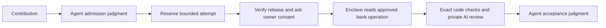

# Verification and agent maintenance

OpenPlaid is building a verifier that checks real bank evidence while keeping session
secrets inside an independently verifiable enclave. Agents can inspect the code,
public prompts, policies and release measurements before asking an account owner
to consent. AI advice does not independently authorize acceptance or payment.

## Current status

The repository includes a development implementation of transactional admission,
bounded budgets, agent judgments, AWS attestation verification, encrypted one-use
sessions, approved-operation acquisition, and a closed AI evaluation protocol.
The release manifest is deliberately **unreleased**, the Mercury acquisition policy
is **disabled**, and there is **no public live verification endpoint yet**. No bank
secrets should be sent until the release and end-to-end checks are complete.

No scheduled agent task or automatic payout is enabled. Existing Round 1 terms remain
unchanged. A contribution can still earn its advertised parser award without meeting
new, unpublished cryptographic-verification requirements.

## Readable by people and agents

- [Agent contract](../verification/agent-contract.json): capabilities, states, decisions and reason codes.
- [Operator skill](../skills/operate-verifier/SKILL.md): how an agent reviews and records progression.
- [Release manifest](../verification/release.json): independent release pinning and readiness.
- [Public model prompt](../verification/prompts/payment-review-v1.txt): the exact review task.
- [Service policy](../verification/policies/service.json): spending, attempts, sizes and authority limits.
- [Mercury source policy](../verification/policies/mercury.json): exact approved surface; currently pending review.
- [Deployment runbook](../verification/infra/README.md): pilot target, validation and cleanup.



## Run locally

Python 3.11+ and OpenSSL are required for verifier development. No live credentials
are needed for the security tests.

```sh
python3 -m venv .local/verifier-venv
.local/verifier-venv/bin/pip install -r verification/requirements.lock
.local/verifier-venv/bin/python -m unittest discover -s verification/tests -v
.local/verifier-venv/bin/python -m verification.cli status
.local/verifier-venv/bin/python -m verification.cli --help
```

The local CLI is an authenticated-operator boundary by deployment, not a public HTTP
API. Do not expose it to PR code, contributors, or an agent interpreting bank content.
SQLite must live on one durable controller; do not run independent database replicas
and assume quotas are global. Judgments bind the current state version and an evidence
digest. A future scheduler can call the same interface; none is configured now.

## Protecting secrets

PCR8 identifies the release signing certificate, not the exact image. Clients require
PCR0/1/2 as well, a fresh nonce, a public key inside the signed attestation, and a policy
digest. The AWS root certificate is pinned by its published SHA-256 fingerprint.
Certificate-chain checks use OpenSSL; COSE signatures are verified locally. A boolean
from the server is never accepted as attestation.

After verification and explicit owner consent, the client encrypts the scoped session
to the attested key. Each challenge expires after two minutes and can be consumed once.
Credentials and original records are not written to the ledger, public logs, CI or Git.
Approved source policy constructs the entire bank request. Contributors cannot supply
arbitrary URLs, redirect targets, HTTP methods, or credential destinations.

Private AI processing must use a separately verified Venice E2EE connection from the
enclave. No plaintext or non-TEE fallback is permitted. Before this is fully integrated
and tested, live AI evaluation remains unavailable. Hosted Jev is not assumed to have
equivalent confidential processing.

## Abuse and griefing controls

An assigned contribution needs an operator judgment before consuming bank/model resources.
Attempts are tied to artifact, release, policy and prompt digests. Atomic reservations
prevent concurrent overspend; retries retain the original reservation. Failed/uncertain
attempts consume their upper-bound allowance. Five attempts and $0.25 per ticket are
development defaults. The task cap is $50, with a separate $5 inference reservation cap.
Infrastructure and purchases must be reserved before they are incurred. These controls
do not replace actual provider caps and finite resource lifetimes.

The AI receives a fixed task and bounded candidates, no tools or credentials. Output
accepts only enumerated decisions and known field references. No model explanations or
arbitrary completion text are returned to contributors. Exact fields and transaction
joins remain code checks. Unknown evidence and disagreement require review, not retries
until a model happens to agree. Public production prompts are versioned; private
adversarial holdouts must be stored separately and never run on untrusted PR hosts.

## Limits

Passing tests is not proof of no vulnerabilities. This development verifier has not
been independently audited. Mercury's current parser describes sender-bank-reported
sent domestic USD wires, not recipient credit or irreversible settlement. An OpenPlaid
verification result is not a Peer settlement signature. Signing, merging and payout
authority must remain separate from untrusted adapter code and model output.

## Machine-readable readiness

Run `npm run verify:readiness`. Exit code 2 means the release cannot accept secrets;
its JSON lists the specific blockers. Configuration alone cannot turn the pilot into
a live service. The current runtime only provides status and attestation operations.
The client secret-sharing helper additionally requires an explicitly live release,
fresh cryptographic verification, the caller's expected contribution binding, and consent.

The policy commitment covers service limits, source destinations, the public prompt,
model trust and controller key configuration. Changing any of these requires a new
reviewed commitment. Dependency installation uses pinned wheel hashes. An independently
reproduced enclave image and actual hardware evidence are still release requirements.

## Remaining release work

| Component | Current state | Required before live release |
| --- | --- | --- |
| Agent admission and spending | Local transactional CLI, tested | Trusted controller deployment and recovery procedure |
| Nitro identity and session channel | Real Nitro attestation and tampering smoke passed; channel crypto tested locally | Independent rebuild, published image/measurements, hardware secret-sharing flow |
| Bank acquisition | Bounded reader; source policy disabled | Review exact bank operation and scope; bounded relay DNS/process watchdog |
| Independent expected result | Separate Python Mercury reference interpreter and negative tests | Independent field-provenance review and integration with authenticated acquisition |
| Contributor execution | Not integrated | Resource-limited isolation with no credentials, signing key or external network |
| Venice review | Encryption and output validation tested locally | CPU/GPU/application verification, key binding and real provider test |
| Verification receipt | Signing, attestation validation and transactional controller acceptance tested | Integrate issuance with the completed enclave evidence pipeline |
| Live consent flow | Client helper only | End-to-end owner consent, encrypted submission and receipt verification |
| Recurring agent judgment | Intentionally absent | Separate future authorization; existing CLI remains usable manually |
| Awards and payouts | Existing published terms | Separate bounded award authority; model output never releases funds |

A trusted maintainer must review changes to the verifier, source/model policies,
release measurements and CI separately from ordinary adapter contributions. PR code
runs only in credential-free CI. Private holdouts and live credentials must never be
made available through a PR workflow or `pull_request_target` checkout.

### Hardware pilot evidence

The [September 23 pilot report](../verification/infra/evidence/2026-09-23-nitro-smoke.json)
records a real non-debug Nitro enclave. Its signed attestation passed AWS certificate
chain and signature verification, fresh nonce, public-key, policy and PCR0/1/2/8
binding checks. Altered nonce, key, policy, measurement and document were rejected.
The runtime also rejected live verification requests. The pilot used no bank credentials
or model key. Its temporary host was deleted after testing.

This is an operator-reported smoke test, not a public approved release or independent
rebuild. The report identifies the base commit and startup patch used for the image;
its measurements must not be copied into a client trust manifest. The complete payment
verification pipeline remains disabled. Venice API authentication has been checked
with a restricted key; provider attestation and paid inference are not yet verified.

### Provider diagnostics

Developer setup installs the operator tooling outside the enclave runtime. To install it separately, use
`.local/verifier-venv/bin/pip install -r verification/requirements-attestation.lock`.
Then run `.local/verifier-venv/bin/python -m verification.provider_diagnostic
--report <local-report.json> --nonce <original-caller-nonce>` with a fresh provider
report and the nonce generated **before** requesting it. Never copy a nonce from
an untrusted report as the expected challenge. The command fetches public Intel
verification collateral from Phala PCCS; it needs no API key and sends no inference.
Its JSON separates CPU cryptography, strict CPU policy and protocol-specific binding.
`--binding-protocol aci-v1` is the default. Select `--binding-protocol legacy-v1`
explicitly for the documented compatibility endpoint; no failed ACI check triggers
a fallback. Legacy verification derives the Ethereum address from the curve-validated
encryption key and checks the signed address, zero padding and original nonce. It does
not authenticate the adjacent ACI keyset or approve receipt keys.
It always exits 2 and never returns an approved key or authorizes disclosure.

The [September 23 diagnostic](../verification/infra/evidence/2026-09-23-venice-diagnostic.json)
checked one fresh `e2ee-qwen-2-5-7b-p` response. Intel quote cryptography passed,
but strict platform policy rejected it. Initial ACI binding checks failed because
the compatibility endpoint uses legacy address-plus-nonce report data despite its
adjacent ACI metadata. The provider's pinned implementation documents this behavior;
explicit legacy checking passed the encryption-key and original-nonce binding.
This is not a claim about all Venice models. Reviewing platform policy remains
necessary; GPU evidence, application identity, key custody and response authenticity
must also pass before private evidence can be sent. The server's `verified` field
does not override any of these checks.

Binding follows the provider's [pinned ACI specification](https://github.com/Dstack-TEE/private-ai-gateway/blob/8d0a666a2418898a8c823a9af49a634edd122a64/spec/aci.md#32-attestation-binding).
The separate compatibility layout is documented in its [legacy implementation](https://github.com/Dstack-TEE/private-ai-gateway/blob/8d0a666a2418898a8c823a9af49a634edd122a64/src/aggregator/service/e2ee.rs).
CPU diagnostics use the [DCAP verifier's strict policy](https://github.com/Phala-Network/dcap-qvl/blob/v0.6.3/docs/policy.md).

### Receipt acceptance boundary

The controller cannot mark an attempt verified from a plain result string. It checks
an RSA-PSS receipt against a fresh Nitro-attested key and an independently pinned live
release, then atomically matches its ticket, capability and full reserved binding.
Receipts use a contribution-verification audience, short expiry, fixed fields and no
bank account/payment details. The ledger retains minimal claims and cryptographic
provenance digests for operator auditing. Duplicate delivery is idempotent; conflicts,
pause and revocation fail closed. Ordinary operator reconciliation can record a failed
attempt, but cannot manufacture success. Runtime issuance is still disabled until the
bank/oracle/sandbox/model pipeline exists and passes end-to-end verification.

### Mercury reference interpretation

`verification/mercury_oracle.py` separately interprets the documented synthetic
Mercury surface without importing contributor code. It uses decimal arithmetic,
checks calendar dates, rejects duplicate selected transactions and ambiguous payer
joins, and requires full recipient identifiers. Its candidate projection excludes
memos and display names. This is a reference implementation for the narrow sent-wire
claim, not proof that uploaded JSON is authentic. It must consume authenticated bank
acquisition inside the verifier; the source policy is still disabled pending review.
